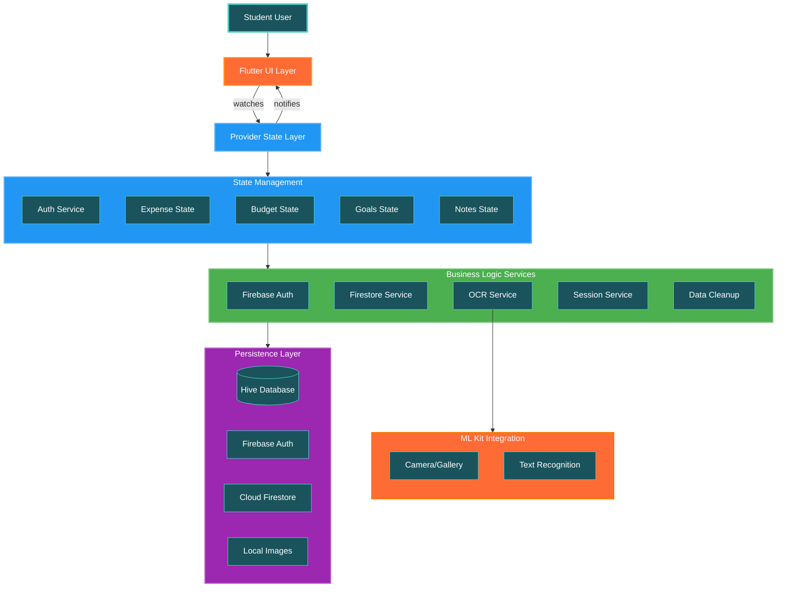

# Smart Expense Tracker - Modern Finance Management for Students

A premium, multi-platform Flutter expense tracking app designed specifically for students to manage their finances smartly. Track expenses, set budgets, achieve financial goals, and gain insights with beautiful UI, Firebase authentication, OCR receipt scanning, and gamification elements.

> Smart. Secure. Student-Focused. Built with Provider, Hive, Firebase, and ML Kit.

<p align="center">
    <a href="https://flutter.dev" target="_blank">
        
    </a>
    <a href="https://dart.dev" target="_blank">
        
    </a>
    <a href="https://pub.dev/packages/provider" target="_blank">
        
    </a>
    <a href="https://firebase.google.com/" target="_blank">
        
    </a>
    <a href="https://pub.dev/packages/hive" target="_blank">
        
    </a>
    <a href="https://pub.dev/packages/google_mlkit_text_recognition" target="_blank">
        
    </a>
    <a href="https://m3.material.io/" target="_blank">
        
    </a>
</p>

---

## 🚀 Highlights

- **Multi-Platform**: Android, iOS, Web, macOS, Windows & Linux (Flutter).
- **Firebase Authentication**: Secure user authentication with email/password and session management.
- **Smart Expense Tracking**: Create, edit, delete, categorize, and analyze expenses with receipt scanning.
- **Budget Management**: Set monthly/yearly budgets, track spending, and get smart alerts.
- **Category System**: Work, Food, Transport, Entertainment, Healthcare, Education with custom icons & colors.
- **Financial Goals**: Set savings goals, track progress, and celebrate achievements.
- **Animated Dashboard**: Real-time analytics with interactive charts and streak tracking.
- **Notes & Reflections**: Rich note-taking for financial insights and planning.
- **Gamification**: Streak tracking, achievements, and motivational financial facts.
- **Light / Dark Themes**: Fully themed with custom design system featuring teal and orange accents.
- **Local-First Storage**: Hive database for offline capability and lightning-fast performance.
- **Smart Analytics**: Category breakdowns, spending trends, and budget insights with FL Chart.
- **Student-Focused**: Features tailored for student financial management and learning.

---

<div align="center">

## 🎬 Smart Expense Tracker Video Demo

<div style="background: linear-gradient(135deg, #1A535C 0%, #FF6B35 100%); padding: 40px; border-radius: 25px; margin: 30px 0; box-shadow: 0 15px 35px rgba(26, 83, 92, 0.3);">

<h3 style="color: white; margin-bottom: 30px;">🌟 Experience Smart Finance Management</h3>

<div style="position: relative; width: 100%; max-width: 800px; margin: 0 auto;">
  <a href="https://your-video-link.example" target="_blank">
    
  </a>
  
  <div style="position: absolute; top: 50%; left: 50%; transform: translate(-50%, -50%);">
    <div style="width: 80px; height: 80px; background: rgba(255,107,53,0.9); border-radius: 50%; display: flex; align-items: center; justify-content: center; box-shadow: 0 8px 25px rgba(0,0,0,0.2);">
      <span style="font-size: 30px; margin-left: 5px;">▶️</span>
    </div>
  </div>
</div>

<br/>

<a href="https://your-video-link.example" target="_blank">
  
</a>
&nbsp;&nbsp;
<a href="https://your-features-video.example" target="_blank">
  
</a>

<p style="color: white; margin-top: 20px; font-style: italic;">
  "See smart financial management in action! 💰✨"
</p>

</div>

</div>

---

<div align="center">

## 📱 Download Smart Expense Tracker for Android

<div style="background: linear-gradient(135deg, #1A535C 0%, #4ECDC4 100%); padding: 50px; border-radius: 30px; margin: 30px 0; box-shadow: 0 20px 50px rgba(26, 83, 92, 0.3);">

<h3 style="color: white; margin-bottom: 40px;">🤖 Get Smart Expense Tracker on Your Android Device</h3>

<div style="background: rgba(255,255,255,0.15); padding: 40px; border-radius: 20px; backdrop-filter: blur(10px); border: 1px solid rgba(255,255,255,0.2);">


<div style="margin: 30px 0;">
  <a href="https://github.com/your-org/smart-expense-tracker/releases/latest/download/smart-expense-tracker.apk" target="_blank">
    
  </a>
</div>

<div style="display: flex; justify-content: center; gap: 20px; margin-top: 30px;">
  
  
  
</div>

<div style="margin-top: 30px; padding: 20px; background: rgba(255,255,255,0.1); border-radius: 15px; border-left: 4px solid #FFF;">
  <p style="color: white; margin: 0; font-size: 14px;">
    <strong>📝 Quick Setup:</strong> Download → Enable "Unknown Sources" → Install → Start Tracking! 🎉
  </p>
</div>

</div>

<div style="margin-top: 30px;">
  
  &nbsp;&nbsp;
  
</div>

</div>

</div>

---

## 📸 Feature Screenshots

<div align="center">

### ✨ Beautiful Interface & Powerful Features

<table style="border: none;">
  <tr>
    <td align="center" width="25%">
      <div style="padding: 20px; background: linear-gradient(135deg, #1A535C, #4ECDC4); border-radius: 15px; margin: 10px;">
        <h4 style="color: white; margin-bottom: 15px;">📊 Dashboard</h4>
        
        <p style="color: white; font-size: 12px; margin-top: 10px;">Real-time analytics & insights</p>
      </div>
    </td>
    <td align="center" width="25%">
      <div style="padding: 20px; background: linear-gradient(135deg, #FF6B35, #FFA000); border-radius: 15px; margin: 10px;">
        <h4 style="color: white; margin-bottom: 15px;">💰 Expense Tracking</h4>
        
        <p style="color: white; font-size: 12px; margin-top: 10px;">OCR scanning & categorization</p>
      </div>
    </td>
    <td align="center" width="25%">
      <div style="padding: 20px; background: linear-gradient(135deg, #2196F3, #64B5F6); border-radius: 15px; margin: 10px;">
        <h4 style="color: white; margin-bottom: 15px;">🎯 Budget Manager</h4>
        
        <p style="color: white; font-size: 12px; margin-top: 10px;">Smart budget tracking & alerts</p>
      </div>
    </td>
    <td align="center" width="25%">
      <div style="padding: 20px; background: linear-gradient(135deg, #4CAF50, #81C784); border-radius: 15px; margin: 10px;">
        <h4 style="color: white; margin-bottom: 15px;">🏆 Goals</h4>
        
        <p style="color: white; font-size: 12px; margin-top: 10px;">Track financial achievements</p>
      </div>
    </td>
  </tr>
</table>

### 🎨 More Features

<table style="border: none;">
  <tr>
    <td align="center" width="33%">
      <div style="padding: 15px; background: linear-gradient(135deg, #9C27B0, #BA68C8); border-radius: 12px; margin: 10px;">
        <h5 style="color: white; margin-bottom: 10px;">📷 OCR Scanning</h5>
        
      </div>
    </td>
    <td align="center" width="33%">
      <div style="padding: 15px; background: linear-gradient(135deg, #FF6B35, #F57C00); border-radius: 12px; margin: 10px;">
        <h5 style="color: white; margin-bottom: 10px;">📝 Smart Notes</h5>
        
      </div>
    </td>
    <td align="center" width="33%">
      <div style="padding: 15px; background: linear-gradient(135deg, #1A535C, #2d3047); border-radius: 12px; margin: 10px;">
        <h5 style="color: white; margin-bottom: 10px;">🌙 Dark Mode</h5>
        
      </div>
    </td>
  </tr>
</table>

<div style="margin: 40px 0; padding: 30px; background: linear-gradient(135deg, #1A535C, #FF6B35); border-radius: 20px; color: white;">
  <h3>🎮 Gamification & Learning Features</h3>
  <div style="display: flex; justify-content: space-around; margin-top: 20px;">
    <div style="text-align: center;">
      <div style="font-size: 3em;">🔥</div>
      <p><strong>Streak Tracking</strong><br/>Maintain daily momentum</p>
    </div>
    <div style="text-align: center;">
      <div style="font-size: 3em;">💡</div>
      <p><strong>Financial Facts</strong><br/>Learn as you track</p>
    </div>
    <div style="text-align: center;">
      <div style="font-size: 3em;">📊</div>
      <p><strong>Visual Analytics</strong><br/>Beautiful charts & insights</p>
    </div>
    <div style="text-align: center;">
      <div style="font-size: 3em;">🎯</div>
      <p><strong>Smart Goals</strong><br/>Achieve financial targets</p>
    </div>
  </div>
</div>

</div>

---

## 🧩 Architecture Overview

The app follows a feature-driven, provider-based architecture emphasizing declarative UI, reactive state management, and clean separation of concerns.

| Layer | Responsibility | Implementation |
|-------|----------------|----------------|
| **Models** | Immutable domain entities & Hive serialization | `Expense`, `Budget`, `Goal`, `Note`, `Category`, `User` |
| **Services** | Business logic, Firebase & ML Kit integration | `AuthService`, `FirestoreService`, `OCRService`, `SessionService` |
| **Providers** | State management & reactive data | Provider (`AuthService`, `ChangeNotifier` patterns) |
| **Features** | Screen-specific UI components | `auth/`, `dashboard/`, `expenses/`, `budget/`, `goals/`, `notes/` |
| **Common Widgets** | Reusable UI components | `themed_background`, `custom_button`, `expense_card` |
| **App** | Core app configuration | `theme/`, routing, Firebase initialization |

### Data Flow
1. UI components watch services and state via `context.watch<T>()` and `context.read<T>()`.
2. User interactions trigger service methods (`addExpense`, `setBudget`, `scanReceipt`, etc.).
3. Services update in-memory state & persist to Hive database with user isolation.
4. Firebase Auth manages user sessions and authentication state.
5. Real-time analytics compute spending patterns and budget status automatically.

### State Management: Why Provider?
- Simple, intuitive API with minimal boilerplate.
- Excellent integration with Flutter's widget tree and BuildContext.
- Clean separation between UI logic and business logic.
- Perfect for student-focused app with straightforward state needs.

### Storage Strategy
- **Hive**: Lightning-fast local NoSQL database for offline-first experience.
- **Firebase Auth**: Secure user authentication and session management.
- **Firebase Firestore**: Cloud backup and sync (optional).
- **User Isolation**: All data is properly isolated per authenticated user with unique keys.

---

## 🛠 Tech Stack

| Category | Tools |
|----------|-------|
| **Framework** | Flutter 3.8+ (Material 3 Design System) |
| **State Management** | Provider (`provider`) |
| **Authentication** | Firebase Auth (`firebase_auth`, `firebase_core`) |
| **Cloud Storage** | Cloud Firestore (`cloud_firestore`), Firebase Storage |
| **Local Storage** | Hive (`hive`, `hive_flutter`) with code generation |
| **Charts** | FL Chart (`fl_chart`) for interactive visualizations |
| **UI & Fonts** | Google Fonts (`google_fonts`), Feather Icons |
| **Image Handling** | Image Picker (`image_picker`) |
| **Date & Time** | `intl`, `shared_preferences` |
| **Utilities** | UUID (`uuid`) for unique identifiers |

---

## 📂 Folder Structure

```
lib/
├── main.dart                          # App entry point with Firebase & Hive initialization
├── firebase_options.dart              # Firebase configuration
├── app/
│   └── theme/
│       └── app_theme.dart            # Material 3 theme with teal/orange design system
├── features/                          # Feature-driven architecture
│   ├── auth/
│   │   ├── screens/
│   │   │   ├── login_screen.dart     # Login with animations
│   │   │   ├── register_screen.dart  # Registration flow
│   │   │   └── auth_checker.dart     # Authentication state handler
│   │   └── widgets/
│   ├── splash/
│   │   └── screens/
│   │       └── splash_screen.dart    # Animated splash with loading
│   ├── onboarding/
│   │   └── screens/
│   │       └── onboarding_screen.dart # First-time user experience
│   ├── main/
│   │   └── screens/
│   │       └── main_screen.dart      # Bottom navigation container
│   ├── dashboard/
│   │   ├── screens/
│   │   │   └── dashboard_screen.dart # Home with analytics & streak
│   │   └── widgets/
│   │       ├── budget_summary_card.dart
│   │       ├── financial_fact_card.dart
│   │       └── quick_actions_card.dart
│   ├── expenses/
│   │   ├── screens/
│   │   │   ├── expense_management_screen.dart
│   │   │   ├── add_expense_screen.dart
│   │   │   └── edit_expense_screen.dart
│   │   └── widgets/
│   │       └── expense_card.dart
│   ├── budget/
│   │   ├── screens/
│   │   │   └── budget_screen.dart    # Budget creation & tracking
│   │   └── widgets/
│   ├── goals/
│   │   ├── screens/
│   │   │   └── goals_screen.dart     # Financial goals management
│   │   └── widgets/
│   ├── notes/
│   │   ├── screens/
│   │   │   ├── notes_list_screen.dart
│   │   │   └── add_note_screen.dart
│   │   └── widgets/
│   ├── profile/
│   │   └── screens/
│   │       └── profile_screen.dart   # User profile & stats
│   ├── settings/
│   │   └── screens/
│   │       └── settings_screen.dart  # App preferences
│   ├── notifications/
│   │   └── screens/
│   │       └── notification_screen.dart
│   └── simulator/
│       └── screens/
│           └── expense_simulator_screen.dart  # Demo data generation
├── models/                           # Data models with Hive adapters
│   ├── expense_model.dart            # Expense entity with categories
│   ├── budget_model.dart             # Budget with types (monthly/yearly)
│   ├── goal_model.dart               # Financial goals tracking
│   ├── note_model.dart               # Note entity
│   ├── category_model.dart           # Category system
│   ├── user_model.dart               # User profile
│   ├── notification_model.dart       # Notification entity
│   └── *.g.dart                      # Generated Hive adapters
├── services/                         # Business logic services
│   ├── firebase_auth_service.dart    # Authentication service
│   ├── firestore_service.dart        # Cloud Firestore operations
│   ├── session_service.dart          # Session management
│   ├── network_service.dart          # Network status
│   ├── data_cleanup_service.dart     # Data management
│   └── fallback_auth_service.dart    # Offline auth fallback
├── common_widgets/                   # Reusable UI components
│   ├── themed_background.dart        # Gradient backgrounds
│   ├── custom_button.dart            # Styled buttons
│   ├── custom_text_field.dart        # Form inputs
│   └── expense_card.dart             # Expense display card
└── utils/                            # Utility functions & constants
    ├── constants.dart
    └── helpers.dart
```

### 🔄 Data Flow Architecture

<div align="center">



</div>

#### 🔍 Architecture Layers Explained

<table>
<tr>
<td width="50%">

**🎯 Frontend Layer**
- **User Interaction**: Touch, gestures, receipt capture
- **Flutter UI**: Material 3 widgets, animations, charts
- **Provider Watching**: Reactive state consumption

**🧠 State Management**
- **Provider Services**: Centralized state via services
- **Real-time Updates**: Automatic UI refresh on data changes
- **User Isolation**: Per-user data with secure keys

</td>
<td width="50%">

**⚡ Business Logic**
- **Firebase Auth**: Secure authentication flow
- **Data Services**: CRUD operations with validation

**💾 Data Persistence**
- **Hive Database**: Fast local storage with adapters
- **Firebase Cloud**: Optional cloud backup & sync
- **File System**: Receipt image storage

</td>
</tr>
</table>

---

## ✅ Features In Detail

| Area | Details |
|------|---------|
| **Authentication** | Firebase Auth with email/password, session management, guest mode |
| **Expense Tracking** | CRUD operations, categories, OCR receipt scanning, amount tracking |
| **Budget Management** | Monthly/yearly budgets, spending alerts, category-wise limits |
| **Financial Goals** | Savings goals, progress tracking, achievement celebrations |
| **Notes System** | Rich note-taking for financial planning and insights |
| **Analytics Dashboard** | Interactive pie charts, spending trends, streak tracking |
| **Category System** | Predefined & custom categories with colors and icons |
| **Gamification** | Streak tracking, financial facts, motivational elements |
| **Security** | User data isolation, secure authentication, offline support |
| **Theming** | Dynamic light/dark themes with teal/orange design system |
| **Persistence** | Offline-first with Hive, cloud backup with Firestore |
| **Student-Focused** | Features tailored for student budget management |

---

## 🔧 Getting Started

### Prerequisites
- Flutter SDK >= 3.8.0
- Dart >= 3.8.1
- Firebase project setup
- Android Studio / VS Code with Flutter extensions
- A device/emulator for testing

### Setup

```bash
# Clone the repository
git clone https://github.com/your-org/smart-expense-tracker.git
cd smart-expense-tracker

# Install dependencies
flutter pub get

# Generate Hive adapters and serialization code
flutter packages pub run build_runner build --delete-conflicting-outputs

# Configure Firebase (add google-services.json for Android, GoogleService-Info.plist for iOS)

# Run on a connected device or emulator
flutter run

# Run tests
flutter test
```

### Firebase Configuration
1. Create a Firebase project at [console.firebase.google.com](https://console.firebase.google.com)
2. Enable Authentication with Email/Password
3. Create a Cloud Firestore database (optional for cloud backup)
4. Create a Firebase Storage bucket (optional for receipt images)
5. Download configuration files:
   - `google-services.json` → `android/app/`
   - `GoogleService-Info.plist` → `ios/Runner/`
6. Run `flutterfire configure` if using FlutterFire CLI

### Platform-Specific Setup
- **Android**: Minimum SDK 21 (Android 5.0)
- **iOS**: Minimum iOS 12.0, configure permissions for camera/photo library
- **Web**: `flutter run -d chrome`
- **Desktop**: Ensure desktop support is enabled (`flutter config --enable-<platform>-desktop`)

---

## 🧪 Testing
- Unit tests for models and services
- Widget tests for critical UI components
- Integration tests for expense tracking flows


```bash
# Run all tests
flutter test

# Run tests with coverage
flutter test --coverage

# Run specific test file
flutter test test/services/ocr_service_test.dart
```

---

## 🎨 Theming & Design System
Centrally defined in `app/theme/app_theme.dart` with Material 3 compliance:

- **Color Palette**: 
  - Primary: Teal (#1A535C) - Professional & trustworthy
  - Accent: Orange (#FF6B35) - Energetic & action-oriented
  - Dark Mode: Rich teal (#4ECDC4) with dark backgrounds
- **Typography**: Google Fonts (Poppins) with consistent hierarchy
- **Components**: Custom cards, buttons, and input fields
- **Backgrounds**: Themed gradients for visual depth
- **Charts**: FL Chart with brand colors for analytics
- **Icons**: Feather Icons for modern aesthetics

Easily customizable for brand adaptation and user personalization.

---

## 🧠 State Management Summary
- **Provider Pattern** for dependency injection and state management
- **AuthService** for authentication state throughout the app
- **ChangeNotifier** for reactive updates when data changes
- **ValueNotifier** for simpler state like theme and preferences
- **Stream Controllers** for real-time Hive box monitoring
- Clean separation between UI state and business logic

---

## 📦 Persistence Strategy
- **Hive Database**:
    - User profiles with unique IDs
    - Expenses with category and date indexing
    - Budgets with type (monthly/yearly) differentiation
    - Goals with progress tracking
    - Notes with timestamps
    - User-isolated data with Firebase UID keys
- **Firebase Firestore**: Optional cloud backup and sync across devices
- **Firebase Storage**: Receipt images with secure URLs
- **SharedPreferences**: App preferences, streak data, last login tracking
- **Data Cleanup**: Automatic cleanup service for orphaned data

---

## 🎮 Gamification & Learning System
- **Streak Tracking**: Daily login streaks with visual indicators and progress
- **Financial Facts**: Educational tips displayed on dashboard for learning
- **Quick Actions**: Gamified shortcuts for common tasks
- **Progress Visualization**: Beautiful charts showing spending patterns
- **Goal Achievements**: Visual progress bars and celebration animations
- **Budget Alerts**: Smart notifications for spending awareness
- **Student Insights**: Analytics tailored for student financial management

---

## 📷 OCR Receipt Scanning
The app uses **Google ML Kit Text Recognition** to extract expense data from receipts:

1. **Capture**: Take a photo or select from gallery
2. **Process**: ML Kit extracts all text from the image
3. **Parse**: Smart parsing to identify amounts, dates, and merchant names
4. **Suggest**: Auto-fill expense form with extracted data
5. **Edit**: User can review and modify before saving
6. **Store**: Receipt image optionally stored with expense

**Supported Formats**: JPEG, PNG, printed receipts with clear text

---

## 🎯 Target Audience
- **Students**: Budget-conscious individuals managing limited income
- **Young Adults**: Learning financial responsibility and tracking habits
- **Budget Learners**: Anyone wanting to understand their spending patterns
- **Mobile-First Users**: People preferring mobile apps for daily tracking

---

## 👥 Contributing

Contributions are welcome! Suggested workflow:
1. Fork the repository
2. Create a feature branch (`git checkout -b feat/receipt-categories`)
3. Follow the existing code style and architecture patterns
4. Add tests for new functionality
5. Update documentation as needed
6. Commit with conventional messages (`feat: add expense categories filter`)
7. Open a Pull Request with clear description and screenshots

Please consider:
- Adding documentation for new services or models
- Including screenshots for UI changes
- Writing tests for business logic
- Following the established folder structure
- Ensuring Hive models have proper adapters

---

## 🐛 Known Issues & Limitations
- **OCR Accuracy**: Receipt scanning accuracy depends on image quality and text clarity
- **Offline Limitations**: Some features require internet (Firebase Auth, cloud backup)
- **Platform Support**: Camera functionality may vary across platforms
- **Date Parsing**: Receipt date parsing may need manual verification

---

## 🔮 Future Enhancements
- [ ] Multiple currency support with conversion
- [ ] Expense splitting for shared costs
- [ ] Recurring expense automation
- [ ] Export to PDF/Excel for reporting
- [ ] Budget recommendations using AI
- [ ] Social features for group budgets
- [ ] Widget support for quick expense entry
- [ ] Voice input for hands-free tracking
- [ ] Bank account integration (Plaid)
- [ ] Bill payment reminders

---

## 🙌 Acknowledgements
- Flutter & Dart teams for the incredible framework
- Provider maintainers for simple state management
- Firebase team for authentication and backend services
- Hive contributors for blazing-fast local storage
- Google ML Kit team for powerful text recognition
- FL Chart for beautiful data visualization
- Google Fonts for typography
- Material Design team for design guidelines
- Open-source community for amazing packages

---
---

## 📬 Contact
Questions? Feedback? We'd love to hear from you:
- **Email**: rwabigwikendra@gmail.com
- **GitHub**: [Report Issues](https://github.com/your-org/smart-expense-tracker/issues)

---

<div align="center">

## 🌟 Ready to Take Control of Your Finances? 

**Smart Expense Tracker** - Where financial wisdom meets smart technology! 💰✨

*Empowering students to make informed financial decisions through intuitive design, powerful analytics, and intelligent automation.*

### 🚀 Start Your Financial Journey Today!

<p>
  
  
  
</p>

**"Your expenses, tracked. Your budget, managed. Your goals, achieved." 🎓💸**

---

**Happy tracking! Let's build better financial habits together! 💪📈🎉**

</div>
